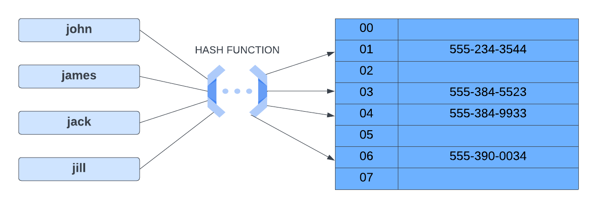

# Hash Table (Hash Map) Intro

In computing, a `hash table` (hash map) is a data structure that implements an associative array abstract data type, a structure that can map keys to values. A hash table uses a hash function to compute an index, also called a hash code, into an array of buckets or slots, where the desired value can be found along with it's index.

Here is a visual representation of a hash table:

We have our keys on the left, which are names of people, and we have our stored values on the right, which in this case, are their phone numbers. In the middle is the hash function.

## Hash Function

A `hash function` is a function that takes in a key and returns an index. The index is used to determine where the key-value pair should be stored in the hash table. The hash function should always return the same index for the same key.

## Hash Collisions

There is something called a hash collision that can occur when using hash tables. A collision occurs when two keys are mapped to the same index in the array. A good hash function will evenly distribute the keys across the hash table. This will minimize collisions and improve the time complexity of the hash table, which I'll talk about in a minute.

## Hash Tables in JavaScript

Hash tables are used in many different languages. In JavaScript, we actually have some built in structures that use hash tables. Even an object is an example of a hash table because data is represented in key-value pairs. We also have a `Map` and a `Set` data structure that use hash tables. In this section, I want to do some challenges that use maps and sets, but I also want to learn how to implement a hash table from scratch.

## Time & Space Complexity

When it comes to time complexity, hash tables are a great data structure for fast lookups. The average time complexity for lookups, insertions, and deletions is O(1). Collisions can slow down the time complexity to O(n).

Space complexity is O(n) because we have to store all of the keys and values in the hash table and the size of the hash table is proportional to the number of keys and values.

| Operation | Time Complexity | Space Complexity |
| --------- | --------------- | ---------------- |
| Access    | O(1)            | O(n)             |
| Search    | O(1)            | O(n)             |
| Insertion | O(1)            | O(n)             |
| Deletion  | O(1)            | O(n)             |

## Hash Methods

Here are some of the methods that are available on a hash table:

- `set(key, value)` - Adds a key-value pair to the hash table.
- `get(key)` - Returns the value associated with a key.
- `remove(key)` - Removes a key-value pair from the hash table.
- `has(key)` - Returns true if the key exists in the hash table, false otherwise.
- `keys()` - Returns an array of all the keys in the hash table.
- `values()` - Returns an array of all the values in the hash table.

We will get to implementing our own custom hash table, but first I want to look at `maps` and `sets` in JavaScript.
