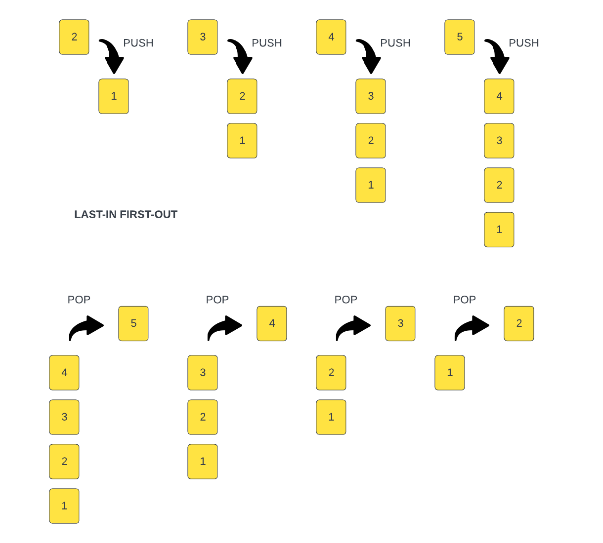

# Stack

A `stack` is a linear data structure that works in a specific way and that is `Last In, First Out` or `LIFO`. This means that the last element added to the stack will be the first element removed from the stack. Think of a stack of plates. The last plate added to the stack will be the first plate removed from the stack.

To give you a better idea, we can look at this image:

In this case, each element is just a number, but it could be anything. We start with a stack with 1 element, we push another one on labeled 2. After that, another one labeled 3, and so on. In this case, the last element added to the stack is 5. We use the term `push` when we add on top of the stack.

If we want to remove an element from the stack, we remove the last one added, which is 5. We can't remove 3 or 2 or 1. We can only remove 5. Once we remove 5, we can then remove 4, 3, 2, and 1. The term for removing from the top of the stack is `pop`.

We know that in JavaScript, Arrays have a `push` and `pop` method. We can use an array as a stack. We can also create our own stack class that only exposes the push and pop methods or we can create our own `push` and `pop` methods via a class.

## Call Stack

A great example of a stack is the call stack. The call stack is a fundamental concept in programming and serves as an execution context for function calls.

The JavaScript engine in the browser has a call stack. In fact, you can view it in your browser dev tools. It is a stack data structure that keeps track of function calls in the order they are made and allows for their orderly execution and return.

When a function is called, a new frame is added to the top of the call stack. This frame contains information such as the function's arguments, local variables, and the position in the code where the function was called from. The function's execution begins, and if it calls other functions, their frames are added on top of the stack, forming a stack of nested function calls as you can see here.

The call stack can be used to debug code and find issues. I'm not going to go over it too much here. We go over this stuff in my Modern JS From the Beginning course. I also have a series on YouTube called "JavaScript: Under The Hood" where I go over the call stack and other JavaScript engine internals. I just wanted to give you a good example where a stack is used.

In the next lesson, we will create our own stack class.
