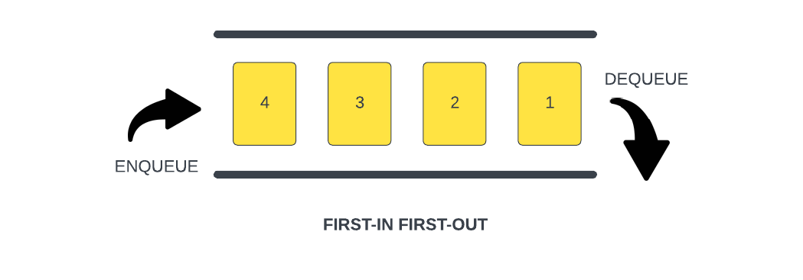

# Queue

A `queue` is a linear data structure that works in a specific way and that is `First In, First Out` or `FIFO`. This means that the first element added to the queue will be the first element removed from the queue. Think of a line at a grocery store. The first person in line will be the first person to be served.

To give you a better idea, we can look at this image:

When we add to the queue, we use the term `enqueue`. When we remove from the queue, we use the term `dequeue`.

We start with a queue with an element labeled 1, we enqueue another one labeled 2. After that, another one labeled 3, and so on. In this case, the first element added to the queue is 1. It is also the first element removed from the queue. We dequeue 1, then 2, then 3, and so on.

We know that in JavaScript, Arrays have a `push` and `shift` method. We can use an array as a queue. We can also create our own queue class that only exposes the enqueue and dequeue methods or we can create our own `enqueue` and `dequeue` methods via a class.

## Event Loop

A great example of a queue is the event loop. The event loop is a fundamental concept in JavaScript and serves as a message queue.

This is a diagram of the entire JavaScript runtime. The call stack is the first thing we talked about. The call stack is a stack data structure that keeps track of function calls in the order they are made and allows for their orderly execution and return.

The event loop is a queue that waits for the call stack to be empty and then pushes messages from the queue to the call stack for execution.

Again, I go over this stuff in my Modern JS From the Beginning course. I also have a series on YouTube called "JavaScript: Under The Hood" where I go over the event loop and other JavaScript engine internals. I just wanted to give you a good example where a queue is used.
