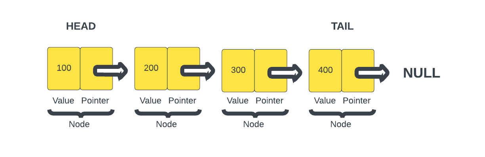

# Linked List

A `linked list` is a linear data structure that is made up of a series of nodes. Each node contains a `value` and a `pointer`. A pointer can mean a lot of different things in programming, in the case of a linked list, it is a reference to another node in the list.

The first node in the list is called the `head`. The last node in the list is called the `tail`. The tail's pointer points to `null` to indicate that it is the last node in the list. We looked at a queue, which also has a head and a tail, but they serve different purposes. In a queue, the head refers to the front of the queue, where elements are `dequeued` (removed) from and the tail is where elements are `enqueued` (added). In a linked list, the head refers to the first node in the list and the tail refers to the last node and always points to `null`. Elements can be added or removed from both the head and the tail.

As you can see in this image, we have a linked list with 4 nodes. Each node has a number as the value and a pointer that points to the next node. The last node or the `tail` points to `null`. 

Unlike arrays, linked lists do not store elements in contiguous memory locations. Instead, each node in a linked list contains a pointer to the next node. This can be very efficient in certain ways, such as inserting and deleting data. It just involves changing a few pointers and can have an O(1) time complexity. However, there are also use cases where they're not very efficient and I'll talk more about that next.

Just know that the basic building block of a linked list is the node, which typically contains two parts:

1. **Data**: It holds the value or payload that represents the information being stored in the linked list.
2. **Next**: It is a reference to the next node in the sequence. This reference connects one node to the next, forming the link between nodes.

## Advantages of Linked Lists

Linked lists offer several advantages and use cases:

- **Dynamic Size**: Linked lists can easily grow or shrink in size as elements are added or removed, as they do not require contiguous memory allocation.
- **Insertion and Deletion**: Inserting or deleting elements at the beginning or end of a linked list is efficient, as it involves updating the references in the affected nodes.
- **Flexible Memory Allocation**: Linked lists can be used when the memory allocation is not known in advance or needs to be managed dynamically.
- **Implementation of Other Data Structures**: Linked lists serve as a foundation for implementing other complex data structures, such as stacks, queues, and graphs.

## Drawbacks of Linked Lists

- **Sequential Access**: Unlike arrays, linked lists do not offer direct random access to elements. Accessing a specific element requires traversing the list from the beginning until the desired node is reached.
- **Additional Memory Overhead**: Linked lists require additional memory to store the references between nodes, which can result in higher memory usage compared to arrays for the same number of elements.
- **Reverse Traversal**: While singly linked lists (with references to the next node only) can be traversed in one direction, reverse traversal or accessing the previous node requires a doubly linked list (with references to both the next and previous nodes).

In the next lesson, we will implement a linked list in JavaScript.
