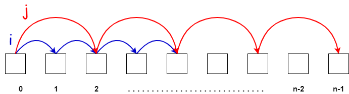

# Working With Pointers

Before we move on to the next challenge, I want to talk more about `pointers` and how they work. In general, pointers are variables that store the memory address of another variable. This concept is more abstract in JavaScript and not as prevalent as in languages like C and C++, where special types and characters are used to declare and work with pointers, such as the `*` character for declaring a pointer variable and the `&` character to get the address of a variable.

In JavaScript, pointers are not explicitly used, but the underlying mechanism is still present when dealing with objects and arrays. It is different with primitive values, so I want to give you an example of both.

Let's start with primitive, which are strings, numbers, booleans, null, undefined and symbols.

Let's examine a simple example:

```JavaScript
let a = 1;
let b = a;
console.log(b); // 1
```

In this example, we have two variables, `a` is set to `1` and `b` is set to `a`. If we log `b` it is `1`. If we change the value of `a`, `b` is not affected. This is because primitive values in JavaScript are assigned by value, not by reference. When you assign a to b, the actual value of a (which is 1) is copied into b. As a result, b becomes an independent copy of the value stored in a, and any subsequent changes made to a will not impact the value stored in b. This behavior is consistent with primitive data types like numbers, strings, and booleans, where each variable holds its own distinct value in memory.

```JavaScript
let a = 1;
let b = a;
a = 2;
console.log(b); // 1
```

Objects and arrays, on the other hand, behave differently. When you assign an object or an array to another variable, you are actually copying the reference to the object or array, not the actual value. This means that both variables will point to the same memory location where the object or array is stored. Consequently, if you modify the contents of the object or array using one variable, the changes will be reflected when accessing the object or array through the other variable. 

Let's look at an example:

```js
const c = {name: 'John'};
const d = c;
console.log(d.name); // John
```

`d` now points to the same area in memory as `c`. If we log `d.name`, we get John. 

If I change the value of `c.name` to Brad and then log `d.name`, you will see that `d.name` is now Brad as well. This is because we copy the reference not the actual value.

```js
const c = {name: 'John'};
const d = c;
c.name = 'Brad';
console.log(d.name); // Brad
```

## Fast and Slow Pointer Pattern

There are different patterns when it comes to pointers. One of the most common patterns is the `fast and slow pointer` pattern. This pattern is used to solve problems where you need to find a certain node or element in a linked list or array. Remember, nodes are objects, so they are passed by reference.

The idea of this pattern is that the pointers start at the same point, but one pointer moves faster than the other. The faster pointer moves at twice the speed of the slower pointer. When the faster pointer reaches the end of the list, the slower pointer will be at the middle node.



let's look at a quick example:

```JavaScript
function findMiddle(head) {
  let slow = head;  // slow pointer
  let fast = head;  // fast pointer

  while (fast !== null && fast.next !== null) {
    fast = fast.next.next; // moves two nodes at a time
    slow = slow.next; // moves one node at a time
  }

  return slow; // returns the middle node
}
```

This `findMiddle` function takes in the head of a linked list and returns the middle node. The function uses two pointers, `slow` and `fast`, to traverse the linked list. The `slow` pointer moves one node at a time because of the `slow.next` assignment, while the `fast` pointer moves two nodes at a time because of the `fast.next.next` assignment.

When the `fast` pointer reaches the end of the list, the `slow` pointer will be at the middle node.

In the next lesson, we are going to implement a find middle function using the `LinkedList` class that we created.
