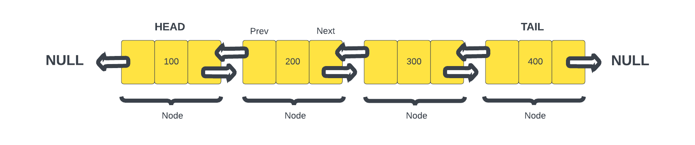

# Doubly Linked List

So we've talked about a linked list and what we have been dealing with is the most common type of linked list and that is a `singly linked list`. Where each node points to the next. Well there are other types of linked lists as well such as the `doubly linked list`. I don't want to get too far into this because it does start to get really advanced, but I at least want to introduce you to the concept of a doubly linked list.

Like a linked list, a `doubly linked list` is a linear data structure made up of a sequence of nodes, but in a doubly linked list, each node contains two pointers: one to the next node and one to the previous node in the sequence. This bidirectional linking allows for more flexibility in traversal and manipulation of the list.

## Structure of a Doubly Linked List

Each node in a doubly linked list contains three parts:

1. **Previous**: A pointer to the previous node in the sequence, enabling traversal in reverse order.
2. **Data**: It holds the value or payload representing the information stored in the node.
3. **Next**: A pointer to the next node in the sequence, facilitating forward traversal.

The first node in the list is the `head`, and the last node is the `tail`. Both the `head` and `tail` pointers can be used to efficiently access the beginning and end of the list.

This image depicts a doubly linked list with four nodes. Each node has pointers to the previous and next nodes. The `head` node's `prev` pointer points to `null` because there is no previous node. Similarly, the `tail` node's `next` pointer points to `null`.

## Advantages of Doubly Linked Lists

Doubly linked lists offer several advantages, building upon the features of a singly linked list:

- **Bidirectional Traversal**: Doubly linked lists allow traversing in both forward and reverse directions efficiently, as each node has pointers to both the next and previous nodes.
- **Efficient Insertion and Deletion**: Insertion or deletion of nodes at the beginning, end, or middle of the list can be more efficient than with singly linked lists, as both the previous and next pointers need to be updated.
- **Reverse Traversal**: Accessing nodes in reverse order becomes possible without the need to reconstruct the list.

## Drawbacks of Doubly Linked Lists

- **Memory Overhead**: Each node in a doubly linked list requires extra memory to store two pointers instead of one. This can lead to increased memory consumption compared to both arrays and singly linked lists.
- **Complexity**: The bidirectional pointers increase the complexity of implementation and maintenance compared to singly linked lists. When inserting or deleting a node in a doubly linked list, you need to update both the previous and next pointers of the affected nodes. This is necessary to maintain the integrity of the list. 

In the next lesson, we will implement a doubly linked list in JavaScript and explore how its features can be utilized.
