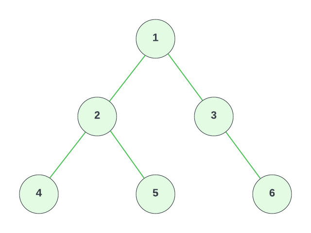
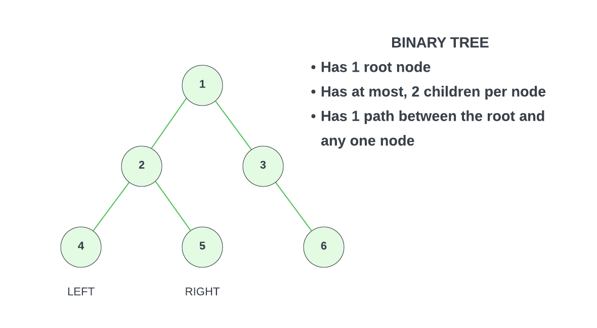

# Tree

A `tree` is a data structure that represents a hierarchical relationship between elements. Trees are widely used in various applications. Things like file systems and organization charts, implementing search algorithms (e.g., binary search tree), and providing efficient data access and manipulation such as in a heap. If you're a web developer, then you're familiar with the DOM (Document Object Model). That is actually an example of a tree structure.

Here is a visual representation of a tree:

The circles represent what are called `nodes`. These nodes contain data or information. In this example, each node just contains a number, but in a real-world application, it could be anything.

The nodes have relationships to each other. These relationships are represented by the lines connecting the nodes. These lines are called `edges`. If we look at the node with the number 2 in it. It is a child of node 1 and a parent of node 4 and 5. 4 and 5 are actually siblings of each other because they share the same parent.

Let's look more into the terminology of trees.

- **Nodes**: Each node in a tree contains data or information and can have zero or more child nodes. Nodes are connected by edges, representing the relationships between them.

- **Root**: The root of a tree is the topmost node and serves as the starting point for traversing the tree. It does not have any parent nodes but may have child nodes.

- **Parent, Child & Sibling Nodes**: A parent node is a node that has child nodes directly connected to it. Child nodes are nodes directly connected to a parent node. Each child node has only one parent node. Nodes that share the same parent node are called sibling nodes.

- **Leaf Nodes**: Leaf nodes, also known as terminal nodes, are nodes that have no child nodes. They represent the endpoints of the tree branches.

- **Path**: A path in a tree refers to the sequence of nodes and edges from one node to another. It represents the route or traversal from the starting node to the destination node. In the image below, the path 1-2-5 represents the route or the path from node 1 to node 5.

### Depth & Height

The terms `depth` and `height` are used to define the structure of a tree. They help us understand how deep or how tall the tree is and provide insight into it's characteristics.

#### Depth Of A Node

The depth of a node refers to the **number of edges along the path from the root node to the particular node**. If we look at the tree above, the depth of node 1 is 0 as it's the root. The depth of node 2 is 1 and the depth of node 4, 5, 6 and 7 is 2.

#### Height Of A Node

The height of a node refers to the **number of edges along the longest path from that node to a leaf node**. It measures how far a node is from the deepest leaf node in a tree. In the tree above, the height of node 1 is 4 since the longest path to the furthest leaf is 4. Node 2 has a height of 2 and node 3 has a height of 3.

#### Height Of A Tree

The height of a tree is the same as the height of it's root node. This tree has a height of 4 since the longest path from the root is 4.

## Bianary Tree

A `binary tree` is a special type of tree that has one root node and each node can have at most two child nodes, often referred to as the `left child` and the `right child` or just left and right. 

The tree that we are looking at is considered a binary tree because it has one root node and each node has at most two child nodes. Node 4 would be the left child of node 2, and node 5 would be the right child of node 2. There is also a clear path between the root and any one node. Sometimes you'll see trees that are split up and there are 3 nodes off by themselves. Or you may see a tree where the nodes are jut connected in a cirlce and there is no clear root. Those are not binary trees.

There are different types of binary trees and there is also something called a `binary search tree`, which we'll look into in a bit. For now, I want to create a `TreeNode` class that will allow us to construct nodes into a binary tree. We'll do that next.
