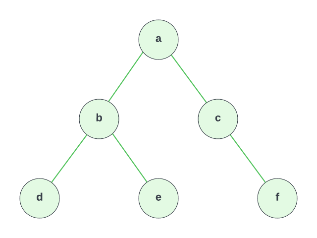

# TreeNode Class & Manual Tree Creation

In this lesson, we will create a `TreeNode` class that will allow us to create a binary tree in JavaScript. We will create our tree manually for now by creating instances of the `TreeNode` class and assigning them to the `left` and `right` properties of other nodes. Later, we will create a `BinaryTree` class that will allow us to create a binary tree by passing in values.

I'm going to set this up as a challenge. If you just want to follow along without trying it yourself, that is absolutely fine. You know what a binary tree is and you know how to create a class. If you want to try it yourself, here are the instructions.

## Instructions

Create a class called `TreeNode`. This will represent a node in the tree. It will have a `value` property and a `left` and `right` property that will point to the left and right child nodes respectively. They will be initialized to `null` when the node is created.

Then use that class to create the following binary tree:



### Hints

- The constructor will take a `value` parameter.
- Initialize the `left` and `right` properties to `null` in the constructor.
- Create an instance for each node in the tree and assign the appropriate values to the `left` and `right` properties.

## Solutions

<details>
  <summary>Click For Solution</summary>

```js
class TreeNode {
  constructor(value) {
    this.value = value;
    this.left = null;
    this.right = null;
  }
}

const a = new TreeNode('a');
const b = new TreeNode('b');
const c = new TreeNode('c');
const d = new TreeNode('d');
const e = new TreeNode('e');
const f = new TreeNode('f');

a.left = b;
a.right = c;
b.left = d;
b.right = e;
c.right = f;
```

### Explanation

- Create the `TreeNode` class with a constructor that takes a `value` parameter.
- Initialize the `left` and `right` properties to `null`. This is because we don't know what the left and right children will be when we create the node. We will assign them later.
- Create an instance of the `TreeNode` class for each node in the tree.
- Assign the appropriate values to the `left` and `right` properties.

The code above implements exactly what we see in the diagram.

</details>
