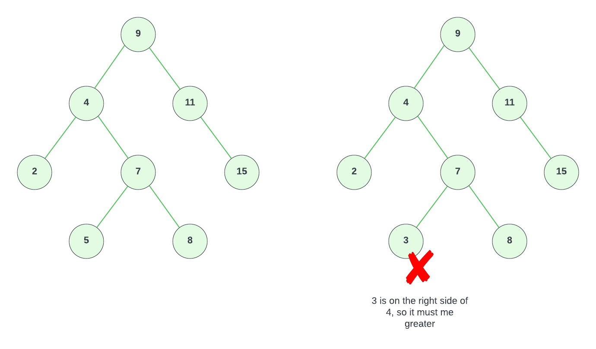

# Binary Search Tree (BST)

Now that you know what a binary tree data structure is, we are going to look at `binary search trees` or `BST`. A binary search tree (BST) is a specific type of binary tree that follows a particular ordering and sorting property. 

While the ordering rule is commonly associated with numeric values, it's important to note that binary search trees can handle various types of data, not just numbers. One of the key advantages of binary search trees are that they're versatile enough to accommodate any data type that can be compared for ordering.

For instance, consider a binary search tree that stores strings representing names in alphabetical order. The tree's structure ensures that names are organized in a way that allows for efficient searches, insertions, and deletions. Similarly, binary search trees can be used for custom objects, where the ordering is determined by specific attributes or properties of the objects such as the price of a product. So we'll be using numeric values just for simplicity and so you can wrap your head around it.

Let's look at the following tree and go over the rules for a BST:

1. Each node has at most two child nodes, referred to as the left child and the right child.
2. The left child's value is less than the parent node's value.
3. The right child's value is greater than or equal to the parent node's value.

The image above is a valid BST. Everything on the left is less than it's parent and everything on the right is greater than the parent.

This does not only apply to immediate child nodes. Let's look at the image on the following image:

If we look at the tree on the right-hand side, it is a valid binary tree, but it is not a valid binary search tree. The reason being that 3 is on the right side of 4, but 3 is less than 4. Everything on the right side of a node must be greater than or equal to the node's value.

This ordering makes searching very efficient. Let's say we are searching for the value 7. We start at the root node of 9. 7 is less than 9, so we move to the left child node of 4. 7 is greater than 4, so we move to the right child node of 4 and we find 7.

The time complexity of search, insertion, and deletion operations in a binary search tree is `O(log n)`, where `n` is the number of nodes in the tree. This is because the search space is reduced by half at each step. This type of searching is much more efficient than a linear search, which instead goes through each element one by one and has a time complexity of `O(n)`.

### Operations on a Binary Search Tree

These are the three main operations on a binary search tree. I'm just going to give you a quick summary on the process for all three. It most likely won't be completely cleat until we actually code it out.

1. **Insertion**: To insert a new node into a binary search tree, we start at the root and compare the new node's value with the current node's value. If the value is less, we move to the left subtree; if it is greater or equal, we move to the right subtree. This process continues recursively until we find an empty spot, where we insert the new node.

2. **Search**: Searching for a value in a binary search tree follows a similar process as insertion. Starting at the root, we compare the value with the current node's value. If it matches, the search is successful. If it is less, we move to the left subtree; if it is greater, we move to the right subtree. This process continues recursively until we find the value or reach a null reference, indicating that the value is not in the tree.

3. **Deletion**: Deleting a node in a binary search tree involves several cases, depending on the node's children. If the node to be deleted has no children (a leaf node), it can be simply removed. If it has one child, that child replaces the deleted node. If it has two children, it can be replaced by either the largest node in its left subtree (called its predecessor) or the smallest node in its right subtree (called its successor). This process maintains the binary search tree property.

Binary search trees are used in various applications where efficient search and retrieval of data are essential. However, it's crucial to ensure that the tree remains balanced to avoid degradation of its performance. There are different balancing techniques like `AVL` trees and `Red-Black` trees to achieve this.

There are online tools that you can use to create a binary search tree and visualize the operations on it such as https://www.cs.usfca.edu/~galles/visualization/BST.html and http://btv.melezinek.cz/binary-search-tree.html.

In the next lesson, let's implement a binary search tree in JavaScript.
