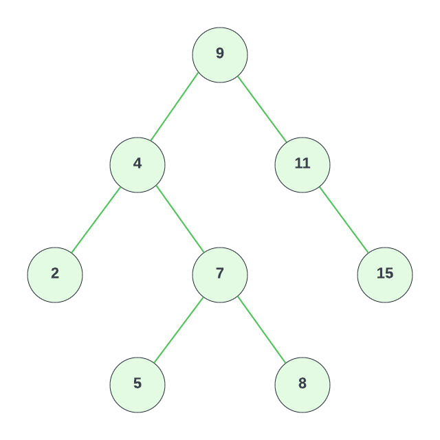

# Binary Search Tree Implementation

In this lesson, we will implement a binary search tree in JavaScript. We will start by creating a `Node` class, which will represent each node in the tree. Each node will have a `value`, a `left` property, and a `right` property. The `left` and `right` properties will point to other nodes, or be `null` if there is no left or right child.

```js
class Node {
  constructor(value) {
    this.value = value;
    this.left = null;
    this.right = null;
  }
}
```

Next, we will create a `BinarySearchTree` class. This class will have a `root` property, which will point to the root node of the tree. Initially, the root node will be `null`.

```js
class BinarySearchTree {
  constructor() {
    this.root = null;
  }
}
```

## `insert` Method

Next, we will implement the `insert` method. This method will take a value as an argument, and insert a new node with that value into the tree.

```js
insert(value) {
  const newNode = new Node(value);

  if (this.root === null) {
    this.root = newNode;
  } else {
    let currentNode = this.root;

    while (true) {
      if (value < currentNode.value) {
        if (!currentNode.left) {
          currentNode.left = newNode;
          return this;
        }

        currentNode = currentNode.left;
      } else {

        if (!currentNode.right) {
          currentNode.right = newNode;
          return this;
        }

        currentNode = currentNode.right;
      }
    }
  }
}
```

We start by creating a new node with the given value.

If the tree is empty, we set the root node to be the new node. Otherwise, we start at the root node, and traverse the tree until we find a node without a left or right child.

If the new value is less than the current node's value, we move on to the left child. If the new value is greater than or equal to the current node's value, we move on to the right child.

We continue this process until we find a node without a left or right child, and then we insert the new node at that location.

## `lookup` Method

Next, we will implement the `lookup` method. This method will take a value as an argument, and return the node with that value if it exists in the tree. If the value does not exist in the tree, we will return `null`.

```js
lookup(value) {
    let currentNode = this.root;

    if (!currentNode) {
      return null;
    }

    while (currentNode) {
      if (value < currentNode.value) {
        currentNode = currentNode.left;
      }
      else if (value > currentNode.value) {
        currentNode = currentNode.right;
      }
      else if (value === currentNode.value) {
        return currentNode;
      }
    }

    return null;
  }
```

We set the current node to be the root node.

If the tree is empty, we return `null`. Otherwise, we traverse the tree until we find a node with the given value.

If the value is less than the current node's value, we move on to the left child. If the value is greater than the current node's value, we move on to the right child. If the value is equal to the current node's value, we return the current node.

If we reach a node that does not have a left or right child, we return `null`.

## `remove` Method

Next, we will implement the `remove` method. This method will take a value as an argument, and remove the node with that value from the tree.

```js
remove(value) {
  const removeNode = (node, value) => {
    if (node === null) {
      return null;
    }

    if (value < node.value) {
      node.left = removeNode(node.left, value);
      return node;
    }
    else if (value > node.value) {
      node.right = removeNode(node.right, value);
      return node;
    }
    else {
      // Case 1: Node with no child or only one child
      if (node.left === null) {
        return node.right;
      } else if (node.right === null) {
        return node.left;
      }

      // Case 2: Node with two children
      // Find the smallest value in the right subtree (successor)
      let tempNode = node.right;
      while (tempNode.left !== null) {
        tempNode = tempNode.left;
      }

      // Case 3: Node is the root node
      // Replace the node's value with the successor's value
      node.value = tempNode.value;

      node.right = removeNode(node.right, tempNode.value);
      return node;
    }
  };

  // Start at the root
  this.root = removeNode(this.root, value);
}
```

This one is pretty tough. We start by creating a helper function called `removeNode`. This function will take a node and a value as arguments, and return the node with the given value removed from the tree.

If the node is `null`, we return `null`. Otherwise, we traverse the tree until we find the node with the given value.

If the value is less than the current node's value, we move on to the left child. If the value is greater than the current node's value, we move on to the right child. If the value is equal to the current node's value, we have found the node we want to remove.

There are three cases we need to consider:

1. The node has no children or only one child
2. The node has two children
3. The node is the root node

### Case 1: Node with no child or only one child

If the node has no children or only one child, we can simply return the node's left or right child. This will remove the node from the tree.

### Case 2: Node with two children

If the node has two children, we need to find the smallest value in the right subtree. This value will be the node's successor. We will replace the node's value with the successor's value, and then remove the successor from the tree.

### Case 3: Node is the root node

If the node is the root node, we need to replace the root node with the successor. We will replace the root node's value with the successor's value, and then remove the successor from the tree.

## `printTree` Method

Finally, we will implement the `printTree` method. This method will print the tree in a human-readable format.

```js
 printTree() {
    const printNode = (node) => {
      if (node === null) {
        return;
      }
      printNode(node.left);
      console.log(node.value);
      printNode(node.right);
    };
    printNode(this.root);
  }
```

## Binary Search Tree Runtime Analysis

BST's are very efficient data structures. They are very fast at inserting, looking up, and deleting values and have a runtime of O(log n) for each of these operations except for printing the tree, which has a runtime of O(n). This is because we have to visit every node in the tree to print it.

| Operation | Runtime  |
| --------- | -------- |
| Insert    | O(log n) |
| Lookup    | O(log n) |
| Delete    | O(log n) |
| Print     | O(n)     |

## Binary Search Tree Example



```js
const bst = new BinarySearchTree();
bst.insert(9);
bst.insert(4);
bst.insert(11);
bst.insert(2);
bst.insert(7);
bst.insert(15);
bst.insert(5);
bst.insert(8);
```

This will create the tree.

We can use the `lookup` method to find a node in the tree. Let's find the node with the value 4 and log it.

```js
console.log(bst.lookup(4));
```

This will log the following:

```js
{
  value: 4,
  left: { value: 2, left: null, right: null },
  right: { value: 7, left: [Node], right: [Node] }
}
```

You can see that the node with the value 4 has a left child with the value 2, and a right child with the value 7.

Let's remove the node with the value 7 from the tree.

```js
bst.remove(7);
```

Now lookup 4 again:

```js
console.log(bst.lookup(4));
```

This will log the following:

```js
{
  value: 4,
  left: { value: 2, left: null, right: null },
  right: { value: 8, left: [Node], right: null }
}
```

You can see that the node with the value 4 now has a right child with the value 8 instead of 7. So it essentially replaced the node with the one that was to the right of it.

Let's print the tree to make sure it looks like the one we created.

```js
bst.printTree();
```

This will print it in order minus the node with the value 7, which we removed.

```
2
4
5
8
9
11
15
```

I know this may have been very overwhelming, but don't expect to master this in a day. It takes time and practice. I recommend you go through this article again and try to understand it better. I also recommend you try to implement this data structure yourself as well as others without looking at the videos or documentation.

### Test Cases

Here is the testing suite that you can use for the binary search tree data structure.

```js
const { Node, BinarySearchTree } = require('./binary-search-tree');

describe('BinarySearchTree', () => {
  let bst;

  beforeEach(() => {
    bst = new BinarySearchTree();
  });

  test('should insert values correctly', () => {
    bst.insert(10);
    bst.insert(5);
    bst.insert(15);
    bst.insert(2);

    expect(bst.root.value).toBe(10);
    expect(bst.root.left.value).toBe(5);
    expect(bst.root.right.value).toBe(15);
    expect(bst.root.left.left.value).toBe(2);
  });

  test('should find existing nodes using lookup', () => {
    bst.insert(10);
    bst.insert(5);
    bst.insert(15);

    expect(bst.lookup(10).value).toBe(10);
    expect(bst.lookup(5).value).toBe(5);
    expect(bst.lookup(15).value).toBe(15);
  });

  test('should return null for non-existing nodes using lookup', () => {
    bst.insert(10);
    bst.insert(5);
    bst.insert(15);

    expect(bst.lookup(2)).toBeNull();
    expect(bst.lookup(8)).toBeNull();
    expect(bst.lookup(20)).toBeNull();
  });

  test('should remove nodes correctly', () => {
    bst.insert(10);
    bst.insert(5);
    bst.insert(15);
    bst.insert(2);
    bst.insert(7);

    bst.remove(2);
    expect(bst.lookup(2)).toBeNull();

    bst.remove(5);
    expect(bst.lookup(5)).toBeNull();

    bst.remove(15);
    expect(bst.lookup(15)).toBeNull();

    bst.remove(10);
    expect(bst.lookup(10)).toBeNull();

    bst.remove(7);
    expect(bst.lookup(7)).toBeNull();
  });

  test('should handle removing root node correctly', () => {
    bst.insert(10);
    bst.insert(5);
    bst.insert(15);

    bst.remove(10);
    expect(bst.root.value).toBe(15);
  });

  test('should print tree in-order', () => {
    const consoleSpy = jest.spyOn(console, 'log').mockImplementation(() => {}); // Spy on console.log and mock the implementation

    const bst = new BinarySearchTree();
    bst.insert(8);
    bst.insert(3);
    bst.insert(10);
    bst.insert(1);
    bst.insert(6);
    bst.insert(14);
    bst.insert(4);
    bst.insert(7);
    bst.insert(13);

    bst.printTree();

    // Expect the console.log to be called with the correct values in in-order traversal
    expect(consoleSpy).toHaveBeenNthCalledWith(1, 1);
    expect(consoleSpy).toHaveBeenNthCalledWith(2, 3);
    expect(consoleSpy).toHaveBeenNthCalledWith(3, 4);
    expect(consoleSpy).toHaveBeenNthCalledWith(4, 6);
    expect(consoleSpy).toHaveBeenNthCalledWith(5, 7);
    expect(consoleSpy).toHaveBeenNthCalledWith(6, 8);
    expect(consoleSpy).toHaveBeenNthCalledWith(7, 10);
    expect(consoleSpy).toHaveBeenNthCalledWith(8, 13);
    expect(consoleSpy).toHaveBeenNthCalledWith(9, 14);

    // Restore the original console.log implementation
    consoleSpy.mockRestore();
  });
});
```
