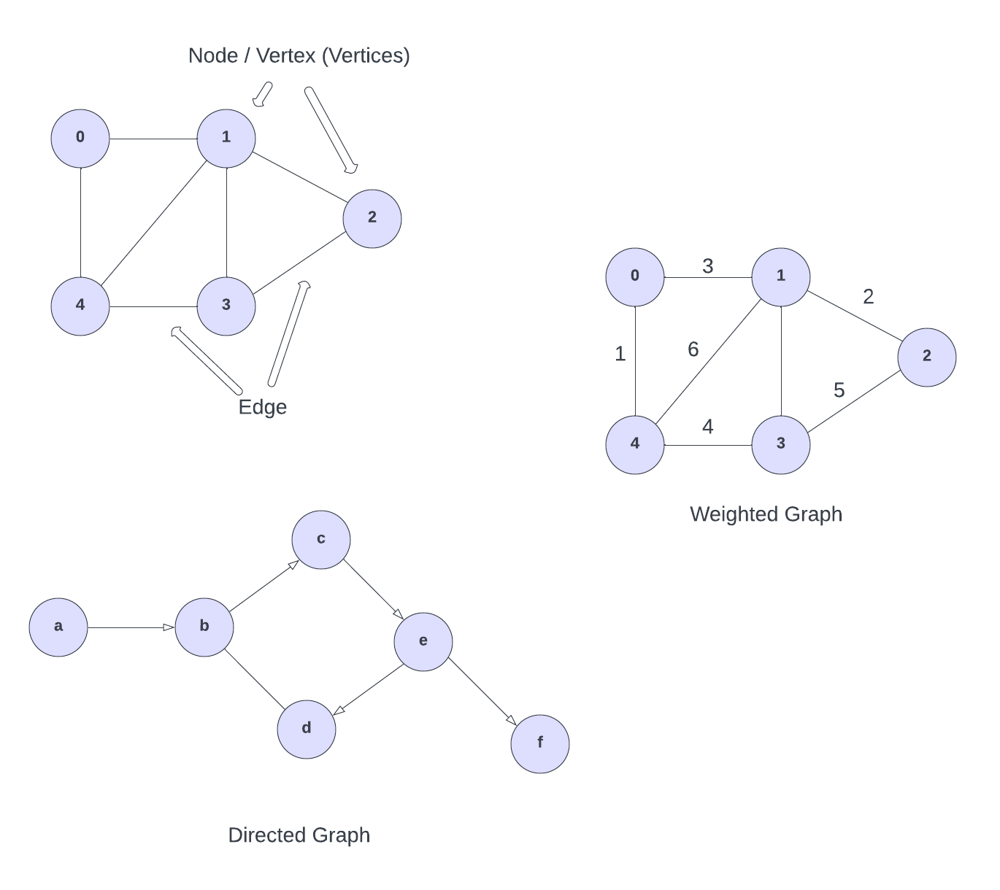
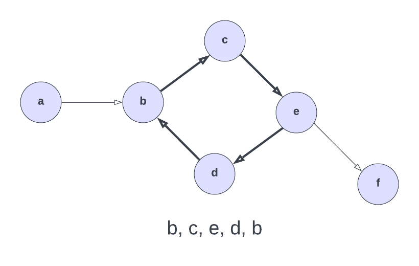

# Graph

A `graph` is a versatile data structure that is similar to a tree. It consists of nodes (also called vertices) and edges (also called links). Each node represents an entity, and each edge represents a connection or relationship between two nodes. Graphs are used to represent many real-world applications: social networks, maps, routing algorithms, and more.

You may hear the phrase "graph theory" in computer science. Graph theory is the study of graphs and their properties. It's a vast field of study with many applications in computer science and other fields.

## Visual Representation of a Graph

Here is a visual representation of a few graphs:

The circles represent `nodes`, also called `vertex` or `vertices` (plural) and the lines connecting the nodes represent `edges`. If you think of a social network, you can think of the users as nodes and the connections or friendships between users as edges.

## Types of Graphs

Graphs can be categorized into several types based on their properties:

- **Undirected Graph**: In an undirected graph, the edges have no direction. If there is an edge between node A and node B, it implies a connection between both nodes in both directions. The top one is an undirected graph.

- **Directed Graph (Digraph)**: In a directed graph, each edge has a specific direction. An edge from node A to node B indicates a one-way connection from A to B. The bottom one is a directed graph.

- **Weighted Graph**: In a weighted graph, each edge has a weight or cost associated with it. These weights represent the strength of the relationship or the distance between nodes.

- **Cyclic Graph**: A cyclic graph contains at least one cycle, which means there is a closed path in the graph. I will give you an example of a cycle in a minute.

- **Acyclic Graph**: An acyclic graph is a graph that does not contain any cycles.

- **Connected Graph**: A connected graph is one where there is a path between any two nodes. In other words, every node in the graph can be reached from any other node.

- **Disconnected Graph**: A disconnected graph is one that consists of two or more separate subgraphs, and there is no path between nodes in different subgraphs.

## Graph cycles

A cycle is a closed path in a graph. In other words, a cycle is a path that starts and ends at the same node. Here is an example of a cycle in a graph:

A cycle starts and ends at the same node. In this example, the cycle is `b -> c -> e -> d -> b`. The cycle can be of any length, and it can contain any number of nodes.

So that is the gist of a graph. In the next lesson, we will learn about 2 ways to represent a graph and those are an adjacency matrix and adjacency list.
