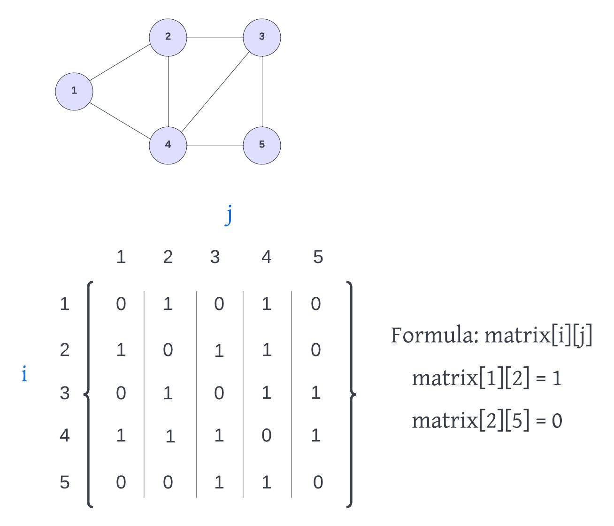
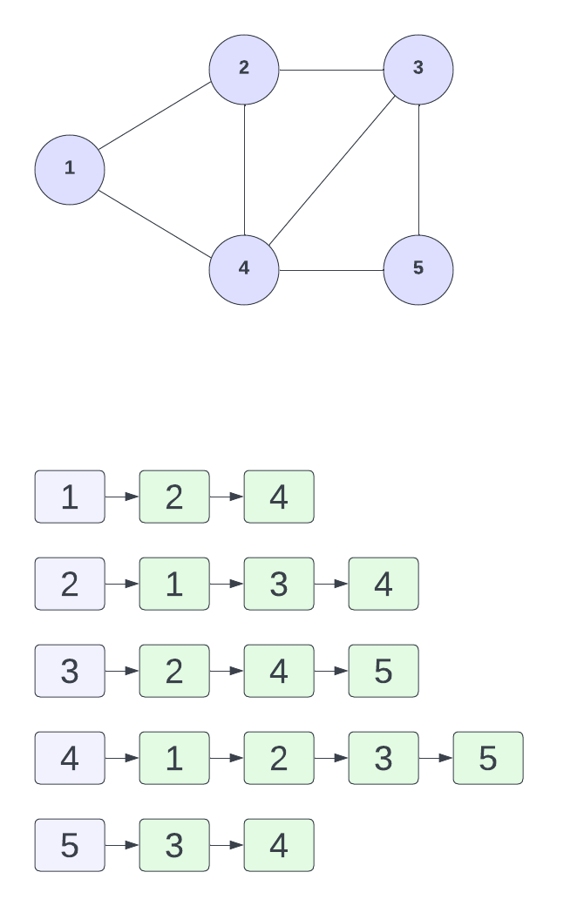

# Adjacency Matrix & Adjacency List

There are two main ways to implement a graph: an `adjacency matrix` and an `adjacency list`. In this lesson, we'll look at both of these approaches.

## Adjacency Matrix

An adjacency matrix is a two-dimensional array that stores the edges between two vertices as boolean values. The rows and columns of the matrix represent the vertices of the graph.

Let's look at an example:



At the top we have a graph with some vertices and edges. At the bottom we have the adjacency matrix representation of the graph. The rows and columns represent the vertices of the graph. If we look at the vertex with the value of 1, we can see that it has edges to vertices 2 and 4. So we put a 1 in the first row for 2 and 4. This is an undirected graph, so it goes the other way as well. So we can put a 1 in the 2 row and the 4 row for 1. If this were a directed graph, we would only put a 1 in the 1 row for 2 and 4.

The formula to see if a vertex `i` is connected to vertex `j` is `matrix[i][j]`. `i` is the row and `j` is the column. So `matrix[1][2]` is 1, which means that vertex 1 is connected to vertex 2. `matrix[2][1]` is also 1, which means that vertex 2 is connected to vertex 1.

To represent this adjacency matrix with a two dimensional array in JavaScript, we can do this:

```JavaScript
[
  [0, 1, 0, 1, 0],
  [1, 0, 1, 1, 0],
  [0, 1, 0, 1, 1],
  [1, 1, 1, 0, 1],
  [0, 0, 1, 1, 0]
];
```

## Adjacency List

An adjacency list is a collection of linked lists or arrays that lists all of the other vertices that are connected. Let's look at an example that uses linked lists. Every vertex has a linked list of all the vertices that it is connected to:



If you wanted to represent this list with a JavaScript object, you could do this:

```JavaScript
{
  1: [2, 4],
  2: [1, 3, 4],
  3: [2, 4, 5],
  4: [1, 2, 3, 5],
  5: [3, 4]
};
```

## Which one is better?

The answer is: it depends. It depends on the type of graph and the type of operations you want to perform on the graph. If you have a graph with a lot of edges, then the adjacency matrix might be better. If you have a graph with a lot of vertices, then the adjacency list might be better. If you want to be able to quickly tell if there is an edge between two vertices, then the adjacency matrix might be better. If you want to be able to quickly iterate over all the edges of a vertex, then the adjacency list might be better. I think overall, in my own opinion, the adjacency list is easier and more commonly used. But it really depends on the situation.

In the next lesson, we will take what we have learned about graphs and implement a graph class in JavaScript.
