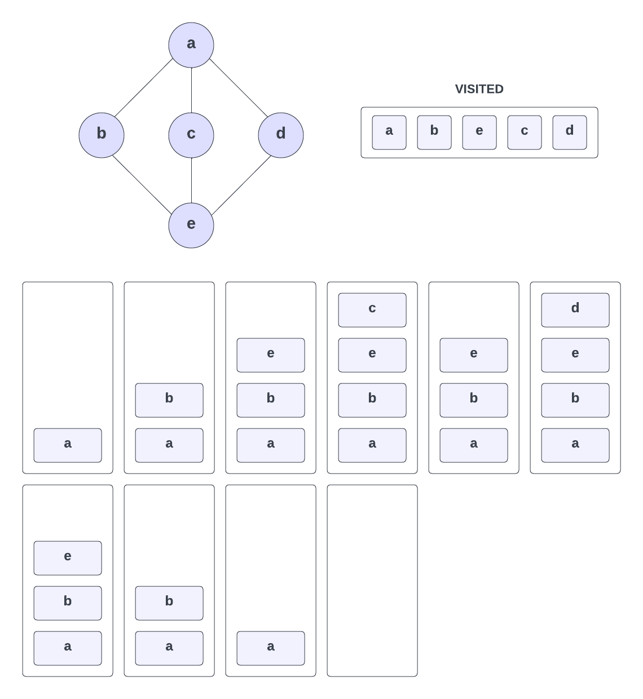
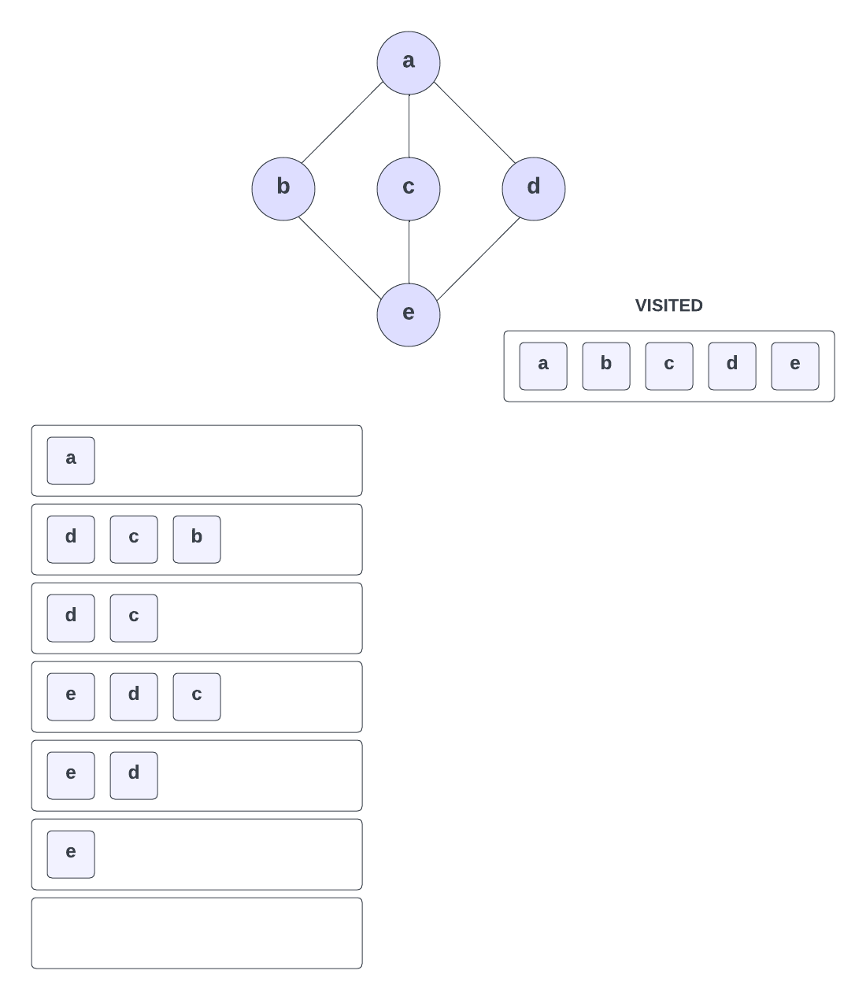

# Graph Traversal

There are a few ways to traverse a graph. The two most common ways are **depth-first traversal** and **breadth-first traversal**.

We have already looked at these using trees, but the same concepts apply to graphs.

## Depth-First Traversal

In depth-first traversal, we start at a vertex/node. In a tree, you would start at the root node. In a graph, you can start at any vertex. We then explore as far along each branch as possible before backtracking. We continue this process until we have visited all of the vertices in the graph.

One common way to implement depth-first traversal is to use a `stack`. We start by pushing the starting vertex onto the stack. We then pop the vertex off the stack and visit it. We then push all of its neighbors onto the stack. We continue this process until the stack is empty.

So take this graph for example:

We have 5 vertices labeled `a` through `e` with 6 edges connecting them. We are going to traverse this graph using depth-first traversal. We could start at any vertex, but let's start at `a` and walk through the process.

- We start at vertex `a` and put it on the stack and mark it as visited

- From here, we can go to vertex `b` or `c`. Let's go to `b`. We put `b` on the stack and mark it as visited

- From `b`, we can go to `e`. We put `e` on the stack and mark it as visited

- From `e`, let's go to `c`. We put `c` on the stack and mark it as visited

- At this point, in both our stack and in the visited table, we have `a`, `b`, `e`, and `c`. `c` does not have any neighbors that we haven't already visited, so we pop it off the stack

- We look at the top of the stack and see that `e` is next. Does `e` have any neighbors that we haven't already visited? Yes, `d`. We put `d` on the stack and mark it as visited

- `d` is now at the top of the stack and does not have any neighbors that we haven't already visited, so we pop it off the stack

- Now `e` is on top of the stack. It has no neighbors that we have not visited, so we pop it off the stack

- Now `b` is on top of the stack. It has no neighbors that we have not visited, so we pop it off the stack

- Now `a` is on top of the stack. It has no neighbors that we have not visited, so we pop it off the stack

- The stack is now empty, so we are done

## Breadth-First Traversal

Now let's explore another graph traversal technique called breadth-first traversal. In contrast to depth-first traversal, which explores as far as possible along each branch before backtracking, breadth-first traversal visits all the vertices at the current level before moving on to the next level.

In order to implement breadth-first traversal, we utilize a queue data structure. Starting from a given vertex, we enqueue it into the queue and mark it as visited. Then, while the queue is not empty, we perform the following steps:

- Dequeue a vertex from the front of the queue.
- Visit the dequeued vertex.
- Enqueue all its unvisited neighbors into the queue and mark them as visited.

By following these steps, we will traverse the graph level by level until all vertices have been visited.

Let's apply breadth-first traversal to the same graph we used for depth-first traversal:

- We start at vertex `a` and enqueue it into the queue

- Then we dequeue `a` from the front of the queue and mark it as visited.

- Now we enqueue all of `a`'s unvisited neighbors into the queue. `a` has three neighbors: `b`, `c`, and `d`. We enqueue them in that order. The queue now looks like this: `b`, `c`, `d`. With the `b` to the right because that is the start.

- Now we dequeue `b` from the front of the queue. We visit `b` and enqueue all of its unvisited neighbors into the queue. 

- `b` has one unvisited neighbor: `e`. We enqueue `e` into the queue. The queue now looks like this: `c`, `d`, `e`.

- We dequeue `c` from the front of the queue. We visit `c` and enqueue all of its unvisited neighbors into the queue. `c` has no unvisited neighbors, so we do not enqueue anything. The queue now looks like this: `d`, `e`.

- We dequeue `d` from the front of the queue. We visit `d` and enqueue all of its unvisited neighbors into the queue. `d` has no unvisited neighbors, so we do not enqueue anything. The queue now looks like this: `e`.

- We dequeue `e` from the front of the queue. We visit `e` and enqueue all of its unvisited neighbors into the queue. `e` has no unvisited neighbors, so we do not enqueue anything. The queue is now empty, so we are done.

The order in which we visited the vertices is: `a`, `b`, `c`, `d`, `e`.
