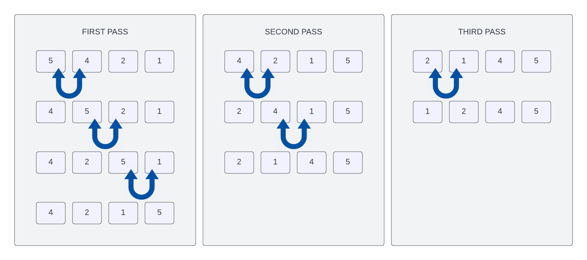

# Bubble Sort Algorithm

In this lesson, we're going to look at the `Bubble sort` algorithm. This is one of the simplest sorting algorithms. It's also one of the least efficient. But it's a good place to start because it's easy to understand. It is also a very common interview question.

## What is Bubble Sort?

The `Bubble sort` sorting algorithm is comparison-based. Each pair of adjacent elements are compared with eachother and the elements are swapped if they are not in order. This is repeated until the list is sorted.

The algorithm gets its name from the way that smaller or larger elements "bubble" to the top of the list. Because it only uses comparisons to operate on elements, it is a `comparison sort`. Although the algorithm is simple, it is too slow and impractical for most problems even when compared to other sorting algorithms such as `insertion sort`. It can be practical if the input is usually in sort order but may occasionally have some out-of-order elements nearly in position.

## How Does Bubble Sort Work?

Let`s look at an example. We have the following array of numbers:

```text
[5, 4, 2, 1]
```

I have an image that can help you visualize this process:



We start by comparing the first two elements in the array. If the first element is larger than the second element, we swap them. Otherwise, we leave them as is. In this case, 5 is larger than 4, so we swap them:

```text
[4, 5, 2, 1]
```

Next, we compare the second and third elements in the array. If the second element is larger than the third element, we swap them. Otherwise, we leave them as is. In this case, 5 is larger than 2, so we swap them:

```text
[4, 2, 5, 1]
```

Next, we compare the third and fourth elements in the array. If the third element is larger than the fourth element, we swap them. Otherwise, we leave them as is. In this case, 5 is larger than 1, so we swap them:

```text
[4, 2, 1, 5]
```

We have now completed one pass through the array. We repeat this process until the array is sorted. In this case, we need to repeat the process three more times:

```text
[2, 4, 1, 5]
[2, 1, 4, 5]
[1, 2, 4, 5]
```

### Complexity & Efficiency

- Worst-case time complexity: O(n^2)
- Best-case time complexity: O(n)
- Average-case time complexity: O(n^2)
- Space complexity: O(1)

The worst-case time complexity is O(n^2) because we have to iterate through the array n times and for each iteration, we have to iterate through the array n times. This is because we have to compare each element with all the other elements in the array. What really makes bubble sorts inefficient is that it swaps elements multiple times per iteration. For example, in the first iteration, it swaps 5 and 4. Then, it swaps 5 and 2. Then, it swaps 5 and 1. It does this for each iteration. This is why the best-case time complexity is O(n). If the array is already sorted, we don't need to swap any elements.
