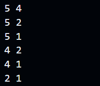

# Challenge: Bubble Sort Algorithm

You've learned about a simple sorting algorithm called Bubble Sort. Let's put your knowledge to the test and implement the Bubble Sort algorithm in JavaScript. Obviously if you have never done anything like this and all you have to go on is the last lesson, then you may have an issue doing this on your own. That's absolutely fine. You can either try and come back or just follow along. Either way, you will learn something.

## Instructions

Implement a function called `bubbleSort` that takes an array of numbers as an argument and returns a sorted array using the Bubble Sort algorithm.

### Function Signature

```js
/**
 * Sorts an array using the Bubble Sort algorithm.
 * @param {number[]} array - The array to be sorted.
 * @returns {number[]} - The sorted array.
 */
function bubbleSort(array: number[]): number[]
```

### Examples

```js
console.log(bubbleSort([5, 4, 3, 2, 1])); // Output: [1, 2, 3, 4, 5]
console.log(bubbleSort([64, 34, 25, 12, 22, 11, 90])); // Output: [11, 12, 22, 25, 34, 64, 90]
```

### Constraints

- The input array can contain any number of elements.
- The elements in the input array are unique and positive integers.

### Notes

- The Bubble Sort algorithm works by repeatedly stepping through the list of elements, comparing each pair of adjacent items, and swapping them if they are in the wrong order. This process is repeated for each element in the list until no swaps are needed.

### Hints

- There are a ton of ways to do this, but one is to use 2 loops. One to iterate the array and one to do the swap. You can set the current element as a temp variable, assign the next element to the current and then assign the temp value to the next element

# Solutions

<details>
  <summary>Click For Solution 1</summary>

```js
function bubbleSort(arr) {
  for (let i = 0; i < arr.length; i++) {
    for (let j = 0; j < arr.length - i - 1; j++) {
      if (arr[j] > arr[j + 1]) {
        const temp = arr[j];
        arr[j] = arr[j + 1];
        arr[j + 1] = temp;
      }
    }
  }
  return arr;
}
```

### Explanation

- Start a `for` loop. The condition of the `for` loop is `i < arr.length`. This will loop through the entire array.
- Inside the `for` loop, start another `for` loop. The condition of the `for` loop is `j < arr.length - i - 1`. This will loop through the array, but it will stop before the last element. This is because the last element will be sorted after the first pass through the array.
- Inside the inner `for` loop, check if the current element is greater than the next element. If it is, then swap the elements.
- We swap the elements by creating a temporary variable called `temp` and setting it to the current element. Then we set the current element to the next element. Finally, we set the next element to `temp`.
- Outside of the inner `for` loop, return the sorted array.

To have this make a bit more sense, put this console log inside the inner `for` loop:

```js
console.log(arr[j], arr[j + 1]);
```

Run this code and look at the console.

```js
const bubbleSort = require('./bubble-sort');

const array = [5, 4, 2, 1];

const result = bubbleSort(array);

console.log(result);
```

This will display every comparison that is made. You can see that the largest element will "bubble" to the top of the array. You can compare it with our image.



</details>

<details>
  <summary>Click For Solution 2</summary>

This solution is similar, but it uses a `while` loop instead of a `for` loop. It also uses a variable called `swapped` to keep track of whether or not we have swapped any elements. This variable will be used to determine when we can stop looping.

```js
function bubbleSort(arr) {
  let swapped = false;

  while (!swapped) {
    swapped = true;

    for (let i = 0; i < arr.length; i++) {
      if (arr[i] > arr[i + 1]) {
        const temp = arr[i];
        arr[i] = arr[i + 1];
        arr[i + 1] = temp;
        swapped = false;
      }
    }
  }

  return arr;
}
```

### Explanation

- Declare a variable called `swapped` and setting it to `false`. This variable will keep track of whether or not we have swapped any elements. We will use this variable to determine when we can stop looping.
- Start a `while` loop. The condition of the `while` loop is `!swapped`. This means that the loop will continue to run as long as `swapped` is `false`. This is the same as saying that the loop will continue to run as long as we have swapped any elements.
- Inside the `while` loop, set `swapped` to `true`. This will ensure that the loop will run at least once.
- Start a `for` loop. The condition of the `for` loop is `i < arr.length`. This means that the loop will continue to run as long as `i` is less than the length of the array.
- Inside the `for` loop, check if the current element is greater than the next element. If it is, then swap the elements and set `swapped` to `false`. This will ensure that the loop will run again.
- Outside of the `for` loop, return the sorted array.

</details>

### Test Cases

```js
test('Sort an array in ascending order', () => {
  const unsortedArray = [5, 2, 8, 1, 3];
  const sortedArray = [1, 2, 3, 5, 8];
  expect(bubbleSort(unsortedArray)).toEqual(sortedArray);
});

test('Sort an array with repeated values', () => {
  const unsortedArray = [4, 1, 3, 4, 2, 2];
  const sortedArray = [1, 2, 2, 3, 4, 4];
  expect(bubbleSort(unsortedArray)).toEqual(sortedArray);
});

test('Sort an already sorted array', () => {
  const sortedArray = [1, 2, 3, 4, 5];
  expect(bubbleSort(sortedArray)).toEqual(sortedArray);
});

test('Sort an array with one element', () => {
  const singleElementArray = [42];
  expect(bubbleSort(singleElementArray)).toEqual(singleElementArray);
});

test('Sort an empty array', () => {
  const emptyArray = [];
  expect(bubbleSort(emptyArray)).toEqual(emptyArray);
});
```
