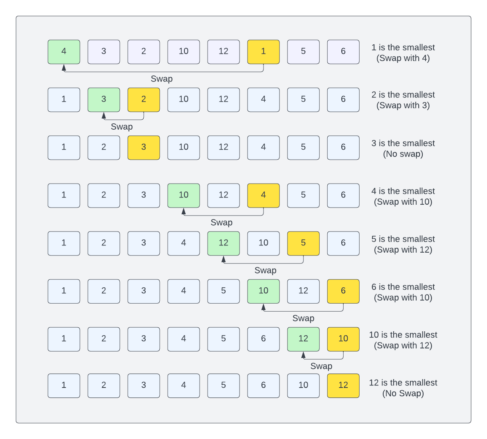

# Selection Sort Algorithm

The selection sort algorithm is a simple sorting algorithm that works by repeatedly selecting the minimum (or maximum) element from the unsorted part of the array and swapping it with the first unsorted element. This gradually builds up a sorted portion of the array.

Let's look at an example:



```text
[4,3,2,10,12,1,5,6]
```

We start by selecting the smallest element in the array, which is 1. We then swap it with the first element in the array.

[1,3,2,10,12,4,5,6]

We then select the next smallest element in the array, which is 2. We then swap it with the second element in the array.

[1,2,3,10,12,4,5,6]

We then select the next smallest element in the array, which is 3. 3 is already in the correct position, so we don't need to swap it.

[1,2,3,10,12,4,5,6]

We then select the next smallest element in the array, which is 4. We then swap it with the fourth element in the array.

[1,2,3,4,12,10,5,6]

We then select the next smallest element in the array, which is 5. We then swap it with the fifth element in the array.

[1,2,3,4,5,10,12,6]

We then select the next smallest element in the array, which is 6. We then swap it with the sixth element in the array.

[1,2,3,4,5,6,12,10]

We then select the next smallest element in the array, which is 10. We then swap it with the seventh element in the array.

[1,2,3,4,5,6,10,12]

12 is already in the correct position, so we don't need to swap it.

[1,2,3,4,5,6,10,12]

The array is now sorted.

### The Process

- Initialization: The algorithm divides the array into two parts: a sorted portion and an unsorted portion. The sorted portion starts as an empty set, and the unsorted portion includes all the elements of the array.

- Selection of Minimum: In each iteration, the algorithm searches through the unsorted portion to find the minimum element.

- Swap and Grow Sorted Portion: Once the minimum element is found, it is swapped with the first element of the unsorted portion. This effectively grows the sorted portion of the array.

- Repeat: The algorithm then considers the next element in the unsorted portion as the new "first" element and repeats the process of finding the minimum element, swapping, and growing the sorted portion.

- Termination: The algorithm continues this process until the entire array is sorted. The sorted portion gradually expands, and the unsorted portion shrinks until it becomes empty.

- Time Complexity: Selection sort has a time complexity of O(n^2), where n is the number of elements in the array. This makes it inefficient for large arrays, but it's simple to implement and performs a fixed number of swaps, which can be advantageous in certain situations.

In the next lesson, we'll look at implementing a selection sort.
