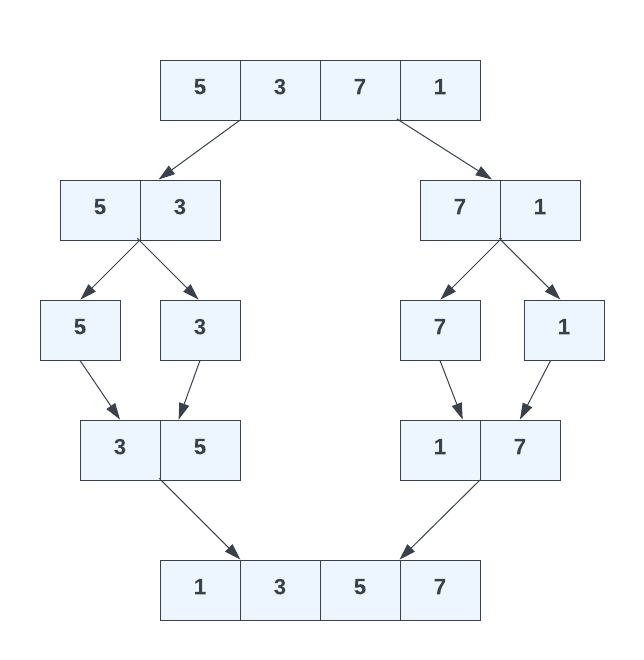

# Merge Sort Algorithm

The merge sort algorithm is a very efficient divide and conquer algorithm. It works by continuously splitting the array in half until it can no longer be divided. Then, it merges each subarray while sorting them in the process. This process continues until the whole array is sorted.

This is the most efficient solution that we've looked at so far. It has a time complexity of O(n log n), which signifies that its performance grows in a linearithmic fashion with the input size. This is different from O(log n), where the growth is purely logarithmic. So it isn't as fast as O(log n) but it's faster than O(n), especially for large data sets. It's definitely faster than the other algorithms we've looked at, which had complexities of O(n^2).

Let's look at an example:



```js
[5, 3, 7, 1];
```

The first step is to split the array in half. We get two subarrays:

```js
[5, 3][(7, 1)];
```

We split each subarray in half again:

```js
[5][3][7][1];
```

Now that we can not go any further, we start merging each subarray while sorting them in the process:

```js
[3, 5][(1, 7)];
```

We merge the two subarrays again:

```js
[1, 3, 5, 7];
```

And we are done!

In the next lesson, we will implement a merge sort algorithm in JavaScript.
