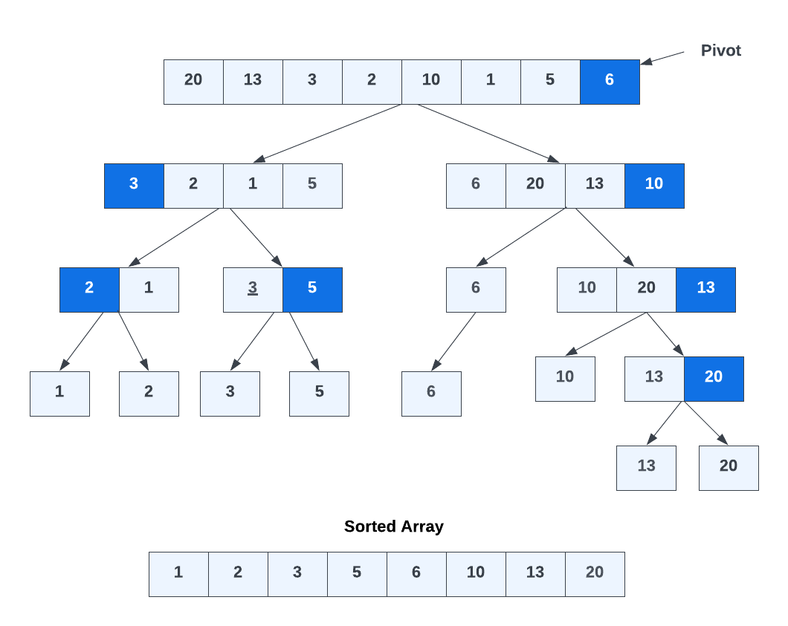

## Quick Sort Algorithm

The Quick Sort algorithm is a highly efficient divide-and-conquer sorting algorithm. It works by selecting a "pivot" element from the array and partitioning the other elements into two subarrays according to whether they are less than or greater than the pivot. The subarrays are then sorted recursively.

Quick Sort offers an average time complexity of O(n log n), making it one of the fastest sorting algorithms available. It's especially efficient for larger datasets. Quick sort has a better space complexity than a merge sort because merge Sort requires additional memory space to create temporary arrays during the merging process. When merging two subarrays, a temporary array is needed to hold the merged elements before they are placed back into the original array. This additional memory usage can be a drawback for Merge Sort, especially when dealing with very large arrays.

### Example

Let's walk through an example using the array `[20, 13, 3, 2, 10, 1, 5, 6]` and choosing the pivot as `6`.




- Choose the pivot element (6) and partition the array:

   ```plaintext
   Pivot: 6
   [20, 13, 3, 2, 10, 12, 1, 5, | 6]
   ```

- Partition the array into two subarrays:

   ```plaintext
   [3, 2, 1, 5] | [6, 20, 13, 10]
            
   ```
- Left: Choose (3) pivot

 ```plaintext
   [2, 1] [3 5] 
            
   ```

- Right: Choose (10) pivot

 ```plaintext
   [6] [10, 20, 13] 
            
   ```
 At this point, 6 is done as there is only one element. This is our recursive case.

 - Left: Choose (2) pivot and (5) pivot

 ```plaintext
   [1] [2] [3] [5]
            
 ```

 These are all done.

 - Right: choose (13) pivot

 ```plaintext
   [10] [13, 20]
            
 ```

 10 is done. Now, (20) as pivot

  ```plaintext
   [13] [20]
            
 ```

 Now there is no more than 1 value per array element and we can combine into one array: [1,2,3,5,6,10,13,20]